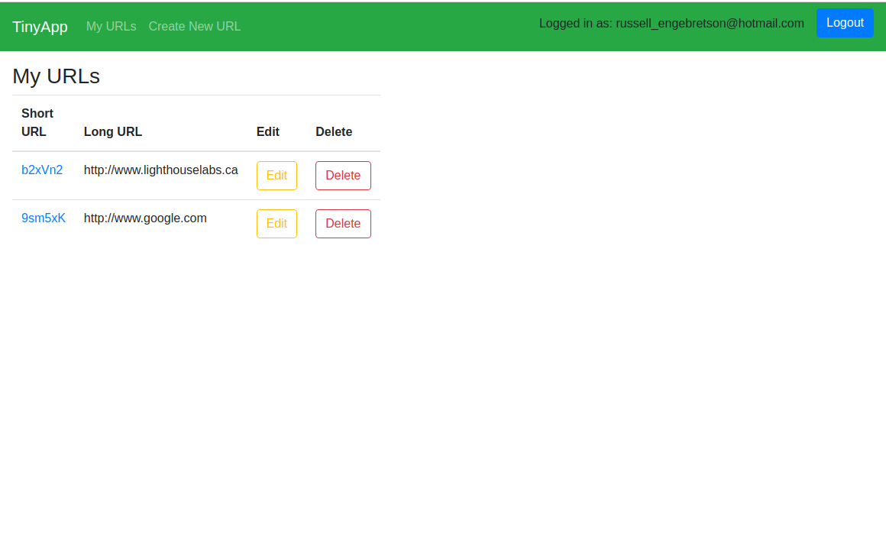
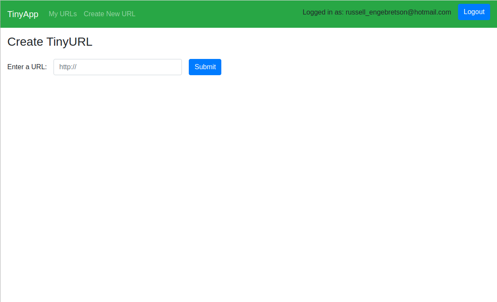
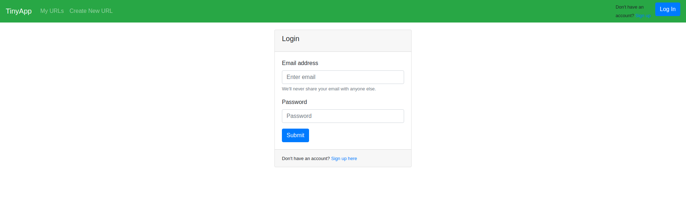

# TinyApp

A simple URL shortening web app (think [bitly](https://bitly.com/)) built using node.js and express on the backend and HTML/CSS/Bootstrap/ejs on the frontend.

Being our first backend focused project, the frontend functionality leaves much to be desired.

## Final Product

## Dependencies

- Node.js
- Express
- EJS
- bcrypt
- body-parser
- cookie-session

## Getting Started

- Install all dependencies (using the `npm install` command).
- Run the development web server using the `node express_server.js` command.